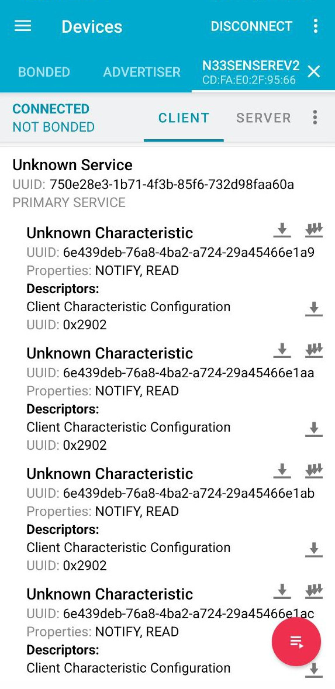
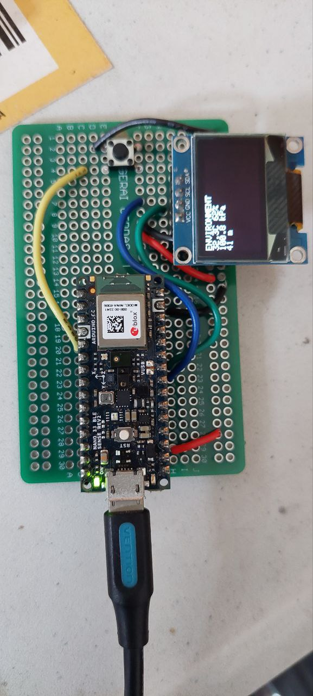

# Abuse Arduino Nano 33 BLE Sense Rev2

several things used in this project

- arduino nano 33 BLE sense rev2
- button
- ssd1306
- seeed studio arduino nano grove shield

features:

- click button to change mode
- BLE characteristics
- you can change the mode in `6e439deb-76a8-4ba2-a724-29a45466e1ae` ble characteristic

nRF connect:

without grove shield

## Mode Reference

| Mode | Sensor Type   | Description                 |
| ---- | ------------- | --------------------------- |
| 0    | Environmental | Temp + Humidity + Pressure  |
| 1    | Proximity     | Distance sensor             |
| 2    | Gesture       | Up/Down/Left/Right gestures |
| 3    | Color         | RGB color sensor            |
| 4    | Accelerometer | 3-axis acceleration         |
| 5    | Gyroscope     | 3-axis rotation             |
| 6    | Magnetometer  | 3-axis magnetic field       |
| 7    | Microphone    | microphone sensor           |

## references

- https://wiki.seeedstudio.com/Grove_LoRa_E5_New_Version/

## TODO

- [ ] Lorawan connection
